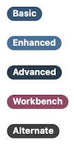

# Quarto Tiers Extension For Quarto

`quarto-tiers` is an extension for Quarto to provide a shortcode to display
styled packaging tiers for Posit pro products.

## Installing

First, install the extension:

```bash
quarto add [posit-dev/quarto-tiers@v3.0.0
```


## Using

The `` shortcode is available once the extension is installed
into your Quarto project.

The `` shortcode displays a badge using the
default styling for that tier. The three packaging tiers include: "Basic", "Enhanced",
and "Advanced". In addition, we've included several additional tiers to fulfill company needs, such as "Workbench", which receives Posit
maroon. The "Alternate" tier and any unassigned tiers use Posit gray.

```markdown





```



Use `tier` shortcode anywhere outside headers; it is appropriate in call-outs,
tables, and inline text. Using the shortcode in a document header causes the
document table-of-contents to render poorly and is not recommended in that
context.

All badges are annotated with the `badge` and `rounded-pill` Bootstrap
classes. Each badge also receives one of the five CSS classes: `badge-basic`,
`badge-enhanced`, `badge-advanced`, `badge-wb`, and `badge-alt`, which define
tier-specific styles.

Additional CSS styles can be provided with the `style` parameter, which will be
added to the badge as inline CSS.

```markdown

```


## Configuration

The `quarto-tiers` YAML configuration can be used to provide optional titles
and URLs for each badge. When the `title` and `url` fields are present beneath
`quarto-tiers`, they provide default values for all product tier badges. Each
tier can override these choices by providing tier-named sub-configurations.
The `title` and `url` fields are optional.

```yaml
quarto-tiers:
  title: "Default tier title."
  url: "https://google.com/search?q=default+tier+url"
  Enhanced:
    title: "The default enhanced title."
  Advanced:
    url: "https://google.com/search?q=default+advanced+url"
```

Additionally, the short-code can supply `url` and `title`. These override any
values provided by the YAML. The `url` and `title` arguments are optional.

```markdown

```

When a URL has been provided, the shortcode produces an `<a ...>Tier</a>` HTML
snippet. Without a URL, a `<span ...>Tier</span>` is emitted.

When a title has been provided, the `<a>` or `<span>` element is given a
`title="TITLE"` attribute.

## Example

Here is the source code for a minimal example: [example.qmd](example.qmd).
